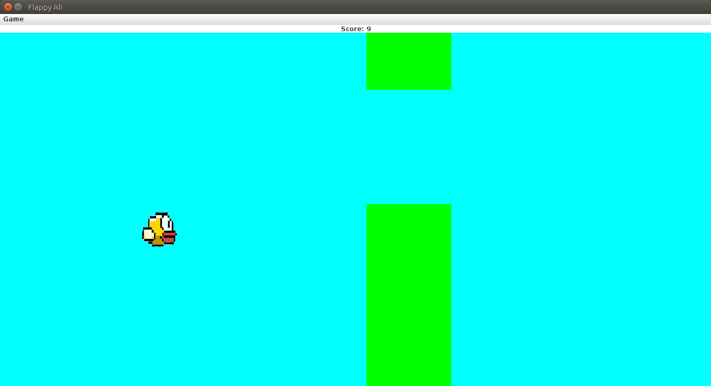

# CrappyBird
A Flappy Bird clone made using Swing Graphics. 

# Why?
A classmate asked me if we could, theoretically, clone Flappy Bird in Java. 10 minutes later, I was showing him how. This is the result. Later, we were given an assignment by one of the teachers in which we had the liberty to build and showcase just about anything. I submitted this shit in order to save time. 

# What's with the weird characters?
The game I submitted to the teacher had my classmates as the characters. I used their pictures in both the game itself and in the character selection screen. The characters also had different names. The different games modes were just subtle jokes about those classmates themselves. I had to change the names and the pictures before uploading the code here of course.

# FlappyAli?
Yeah, that's what this game was originally called. Ali is the name of that classmate who asked me if it were possible to do this. I thought I might as well make him the titular character. I rechristened the game to Crappy Bird before uploading but didn't notice that one of the folders still carried the old name.

